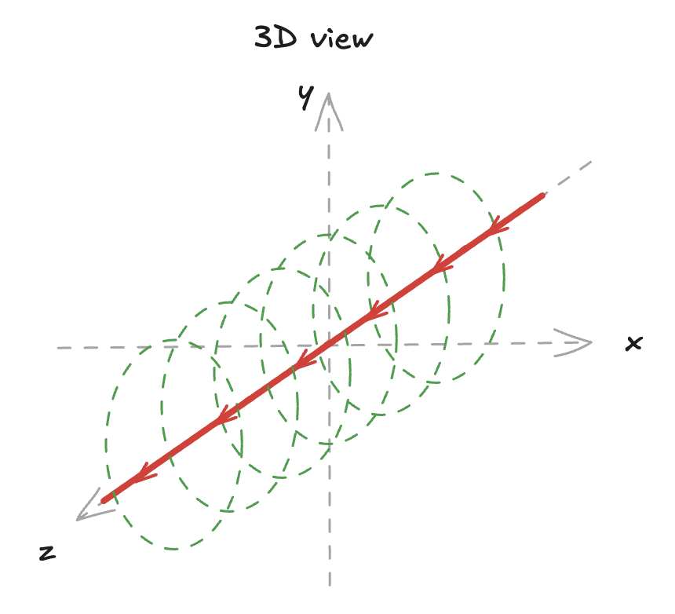
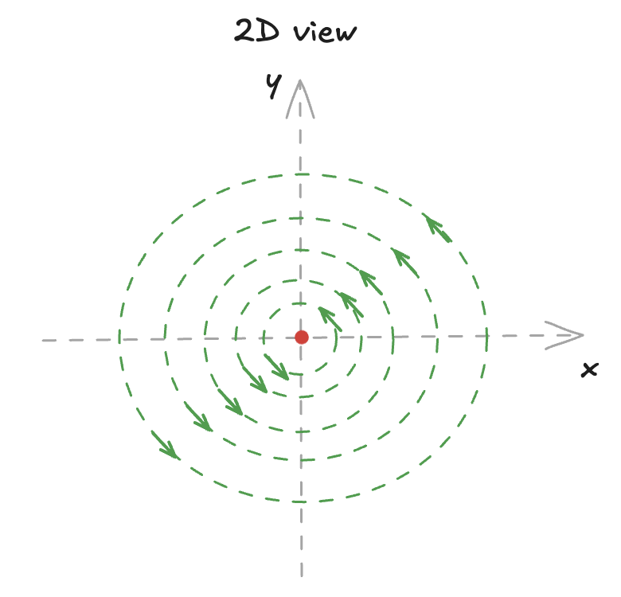
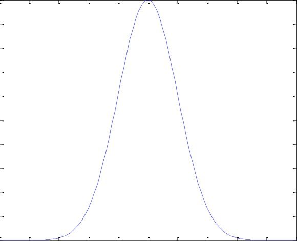

# classic 2-D time-harmonic EM problem with Gaussian pulse line source

 

## EM formula

$$\frac{\partial ^2Ez}{\partial x^2}+\frac{\partial ^2Ez}{\partial y^2}-με\frac{\partial ^2Ez}{\partial t^2}=-μI_0e^{-\frac{(t-t_0)^2}{τ^2}}$$

## Boundary condition

### left

$$\frac{\partial Ez}{\partial x}+\frac{1}{c}\frac{\partial Ez}{\partial t}=0$$

### right

$$\frac{\partial Ez}{\partial x}-\frac{1}{c}\frac{\partial Ez}{\partial t}=0$$

### top

$$\frac{\partial Ez}{\partial y}-\frac{1}{c}\frac{\partial Ez}{\partial t}=0$$

### bottom

$$\frac{\partial Ez}{\partial y}+\frac{1}{c}\frac{\partial Ez}{\partial t}=0$$

## Initial condition

$$x=0, y=0, t=0, Ez=0$$