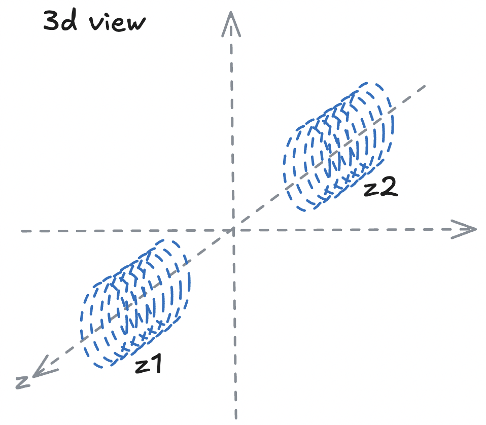
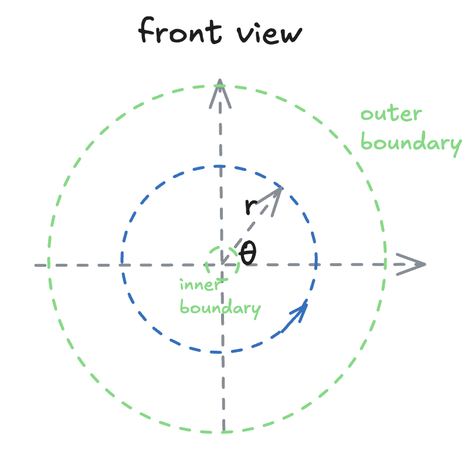
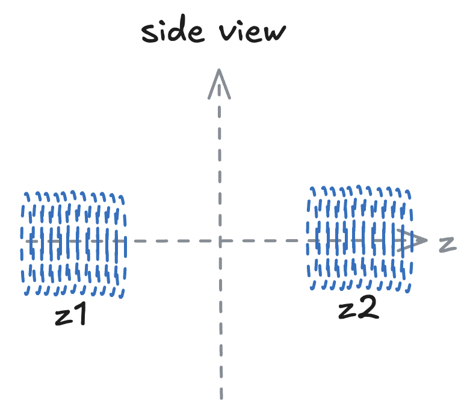
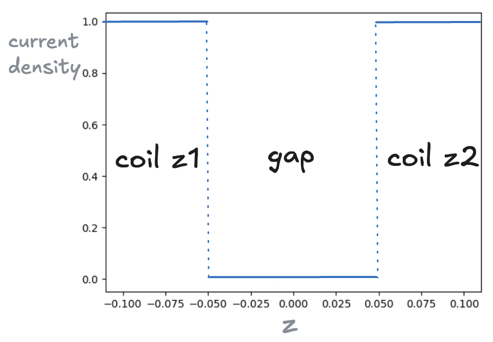
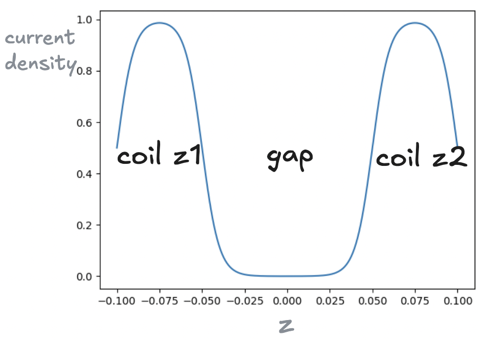

# classic time-harmonic EM problem with pulsed current in solenoids

  
  
  

## PDE formula

$${\huge J_θ=e^{-(\frac{r-r_{coil}}{coil\textunderscore thickness})^2*[sigmoid(z-z1_{left})*sigmoid(z1_{right}-z)+sigmoid(z-z2_{left})*sigmoid(z2_{right}-z)]}}$$

$${\huge \frac{\partial ^2A_θ}{\partial r^2}+\frac{1}{r}*\frac{\partial A_θ}{\partial r}+\frac{\partial ^2A_θ}{\partial z^2}-\frac{1}{r^2}*A_θ+μ
*J_θ=0}$$

## Boundary condition

### Outer boundary:

$${\huge \frac{\partial A_θ}{\partial r}=0}$$

### Inner boundary

$${\huge A_θ = 0}$$

## Current density smooth approximation

### current density along z axis

### differentiable smooth approximation of current density 
